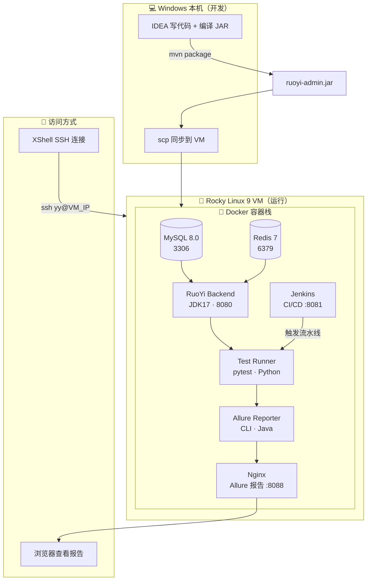
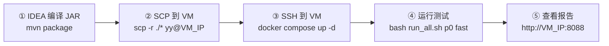
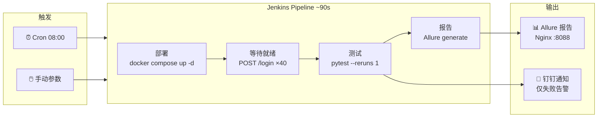
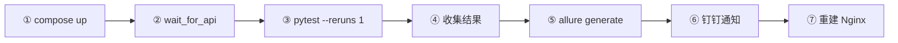
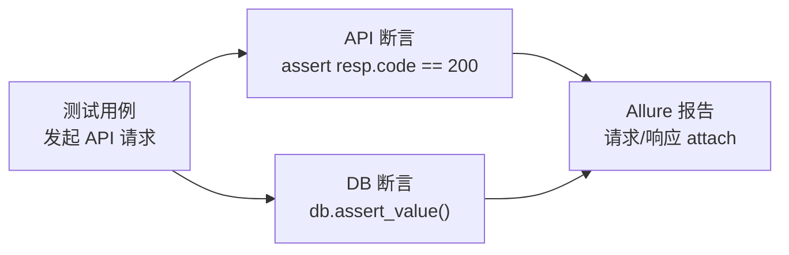

<div align="center">

# 🏗️ RuoYi API Test Framework

> 企业级接口自动化测试框架 · POM 三层架构 · 双引擎驱动 · Docker 容器化 · Jenkins CI/CD

[](https://python.org)
[](https://pytest.org)
[]()
[]()
[]()
[]()
[]()
[]()

</div>

<div align="center">

| 🏗️ 架构 | ⚡ 双引擎 | ✅ 双断言 | 🔁 CI/CD |
|:---:|:---:|:---:|:---:|
| POM 三层 | 代码 + Excel | API + DB | Jenkins 全自动 |
| 🐳 Docker | 📊 Allure | 🔒 安全测试 | 🧹 工程化 |
| 8 容器编排 | 动态报告 | SQL/XSS/越权 | Pylint 10.0 |

</div>

---

## 📊 快速一览

| 指标 | 数值 |
|------|------|
| **测试用例** | 31 条代码用例 + N 条 Excel 数据驱动 |
| **接口覆盖** | 20+ 个 REST API（角色/用户/登录/安全） |
| **代码质量** | ⭐ **Pylint 10.00/10**（满分） |
| **测试覆盖率** | 98%+（api/ + utils/ 核心模块） |
| **构建时间** | 全量 ~90s，P0 冒烟 < 30s |
| **失败重试** | 网络波动自动重试 1 次 |
| **部署方式** | Docker Compose 一键部署 / 本地直连 |
| **CI/CD** | Jenkins Cron 每日 08:00 + 参数化手动构建 |

---

## 🏗️ 架构全景

### 系统架构图



### POM 三层架构

```mermaid
flowchart LR
    subgraph Test["🧪 测试用例层"]
        TR["test_role.py"]
        TS["test_system_user.py"]
        TSE["test_security.py"]
        TBF["test_business_flow.py"]
        EX["test_excel_driver.py"]
    end

    subgraph API["📦 API 对象层 (POM)"]
        LA["LoginApi"]
        RA["RoleApi"]
        SUA["SystemUserApi"]
    end

    subgraph Base["🔧 基础设施层"]
        BA["BaseApi<br/>Session · Token · 重试"]
        DB["DbClient<br/>数据库断言"]
        DR["DataDriver<br/>Excel 引擎"]
    end

    subgraph Utils["⚙️ 工具"]
        LG["Loguru 日志"]
        AL["Allure 报告"]
        CF["Config 多环境"]
    end

    Test -->|fixture 注入| API
    API -->|继承| Base
    Base -->|调用| Utils
```



---

## 🚀 快速开始

### 前置条件

| 工具 | 版本 | 用途 |
|------|:----:|------|
| Docker + Compose | 24+ | 运行测试环境 |
| JDK 17 + Maven | 17+ | 编译 RuoYi JAR（仅首次） |
| Python | 3.11+ | 本地调试 |

### 启动流程



**详细步骤：**

```bash
# 1. Windows 编译 JAR（IDEA Maven 面板）
#    mvn package -DskipTests
#    cp ruoyi-admin/target/ruoyi-admin.jar docker/ruoyi/jar/

# 2. SCP 到 VM
scp -r ./ruoyi_api_test/* yy@192.168.149.100:/home/yy/ruoyi-api-test/

# 3. SSH 启动服务
ssh yy@192.168.149.100
cd /home/yy/ruoyi-api-test
docker compose up -d

# 4. 运行测试
bash scripts/run_all.sh p0 fast

# 5. 查看报告
#    http://192.168.149.100:8088
```

### 访问地址

| 服务 | 地址 |
|------|------|
| SSH | `ssh yy@192.168.149.100` |
| Allure 报告 | `http://192.168.149.100:8088` |
| Jenkins | `http://192.168.149.100:8081` |

---

## 🔄 CI/CD 流水线

### 触发方式

| 方式 | 配置 | 说明 |
|:---|:---|:---|
| ⏰ Cron | `H 8 * * *` | 每天早上 08:00 自动触发 |
| 🖱️ 手动 | 参数化构建 | Jenkins UI 选择 MODE/MARKER |
| 🔌 Webhook | 未实现 | 预留 GitHub Push 触发 |

### 流水线流程



### run_all.sh 7 步流程



---

## 📁 项目结构

```
ruoyi_api_test/
├── api/                    # POM API 对象层
│   ├── base_api.py         #   基类：Session/Token/重试/Allure
│   ├── login_api.py        #   登录模块
│   ├── role_api.py         #   角色管理 CRUD
│   └── system_user_api.py  #   用户管理 CRUD
├── config/
│   └── config.py           #   多环境配置 (dev/staging/prod/docker)
├── data/
│   └── test_cases.xlsx     #   Excel 数据驱动测试数据
├── docker/
│   ├── allure/Dockerfile   #   Allure CLI 2.32 镜像
│   ├── mysql/init/         #   MySQL 初始化脚本
│   ├── nginx/              #   Nginx 配置
│   └── ruoyi/              #   RuoYi 后端 Dockerfile + JAR
├── scripts/                #   编排脚本
│   ├── run_all.sh          #   CI/CD 主控脚本
│   ├── wait_for_api.sh     #   等待后端就绪
│   ├── notify.sh           #   钉钉通知
│   ├── deploy.sh           #   一键部署
│   └── performance_test.py #   Locust 压测
├── tests/                  #   pytest 测试用例
│   ├── conftest.py         #   Fixture 定义
│   ├── test_role.py        #   角色模块 10 条
│   ├── test_system_user.py #   用户模块 9 条
│   ├── test_security.py    #   安全测试 11 条
│   └── test_business_flow.py # 端到端 1 条
├── utils/
│   ├── db_utils.py         #   数据库连接池 + 断言
│   ├── data_driver.py      #   Excel 数据驱动引擎
│   ├── allure_utils.py     #   Allure 报告辅助
│   ├── excel_utils.py      #   Excel 读取
│   └── logger.py           #   Loguru 日志
├── docker-compose.yml      #   8 容器编排
├── Dockerfile.test         #   测试容器镜像
├── Jenkinsfile             #   Jenkins Pipeline
├── Makefile                #   快捷命令
├── pytest.ini              #   Pytest 配置
└── conftest.py             #   全局 conftest
```

---

## ⚡ 常用命令速查

| 命令 | 用途 |
|------|------|
| `docker compose up -d` | 启动后端服务 |
| `bash scripts/run_all.sh p0 fast` | 完整流水线 |
| `bash scripts/run_all.sh all clean` | 全量测试 + 重建 |
| `make lint` | Pylint 代码检查 |
| `docker compose logs -f ruoyi-api` | 查看后端日志 |

---

## 🧪 测试覆盖

| 模块 | 文件 | 用例数 | 级别 | 说明 |
|:---|:---|:---:|:---:|:---|
| 角色管理 | `test_role.py` | 10 | P0/P1/P2 | CRUD + 状态 + 授权 + DB 断言 |
| 用户管理 | `test_system_user.py` | 9 | P0/P1 | CRUD + 状态 + 密码重置 |
| 安全测试 | `test_security.py` | 11 | P1/P2 | SQL 注入 + XSS + 越权 + 伪造 Token |
| 业务流 | `test_business_flow.py` | 1 | P0 | 创建用户→授权→验证全流程 |
| 数据驱动 | `test_excel_driver.py` | N | — | Excel 配置化用例 |

---

## 🔒 安全测试发现

**BUG-001：** 角色名包含 `<B oncopy=alert(1)>test</B>` 时，Jackson JSON 解析器返回 500（应返回 400 参数错误），标记为 xfail。

---

## ✅ 双维度断言体系



---

## 🐳 Docker 容器拓扑

```
ry-network (bridge)
├── mysql:8.0       →  3307:3306  healthcheck ✓
├── redis:7-alpine  →  6379:6379  healthcheck ✓
├── ruoyi-api       →  8080（内部）depends: mysql+redis
├── test-runner     →  pytest（profile: test，临时容器）
├── allure-reporter →  Allure CLI（profile: report，临时容器）
├── allure-report   →  Nginx :8088 报告托管
└── jenkins         →  :8081 CI/CD
```

---

## 📦 技术栈

| 组件 | 用途 |
|------|------|
| Pytest 7.4+ | 测试框架 + fixture + marker 分级 |
| Requests | HTTP 客户端（Session 连接池复用） |
| allure-pytest | 动态报告，失败自动 attach |
| mysql-connector-python | 数据库连接池（10 连接复用） |
| pytest-rerunfailures | 失败用例自动重试 |
| pytest-xdist | 多进程并行执行 |
| Locust | 性能压测（50/100 并发） |
| Docker Compose | 8 容器编排 |
| Jenkins | CI/CD 流水线 |
| pre-commit | Git 提交前代码检查 |
| Pylint 10.0 | 静态代码分析 |

---

## 📚 文档体系

| 文档 | 位置 |
|------|------|
| 测试计划 | `docs/test-plan/role-management-plan.md` |
| 测试用例 | `docs/test-cases/role-management-cases.md` |
| 缺陷报告 | `docs/bug-reports/bug-001-xss-json-crash.md` |
| 测试总结 | `docs/test-summary/role-management-summary.md` |
| 性能报告 | `docs/test-summary/performance-benchmark.md` |

---

## 📜 许可证

MIT License

---

<div align="center">

[GitHub](https://github.com/Mavie521/ruoyi-api-test) · [Jenkins](http://192.168.149.100:8081) · [Allure Report](http://192.168.149.100:8088)

</div>
